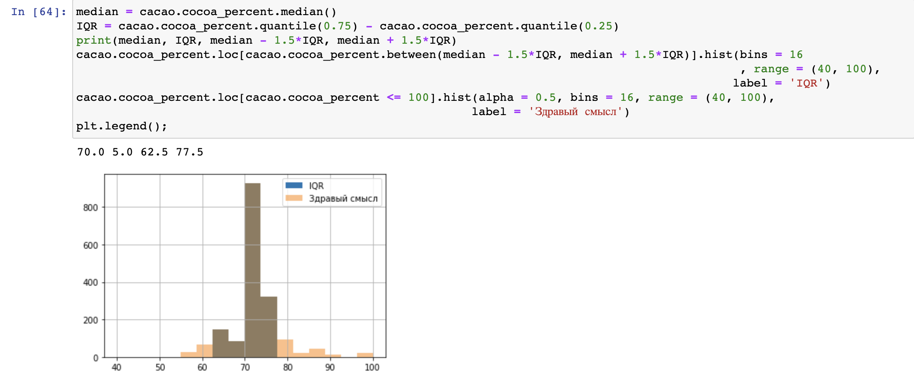
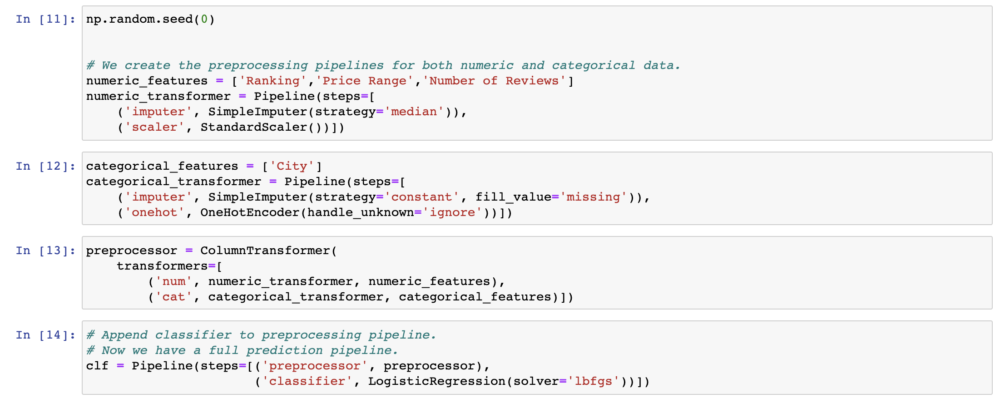
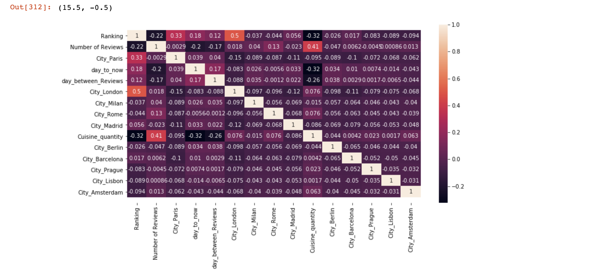
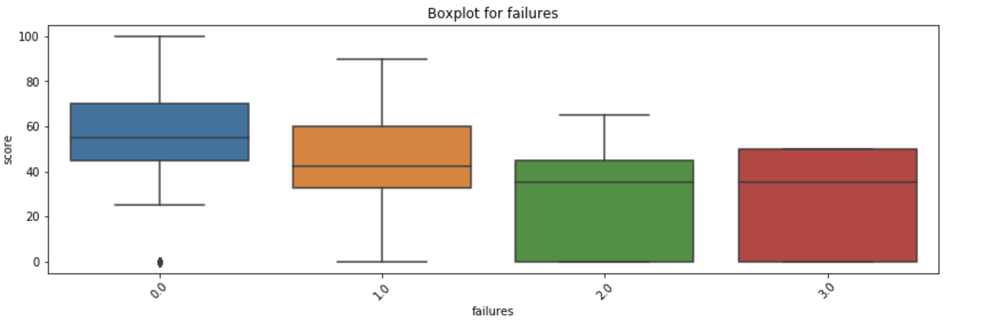

# Portfolio
Portfolio projects for Machine Learning Engineer
## Demonstration Images

![Correlation]

## Table of Contents by topic
* [Graphs, Data cleaning, Feature engineering, Preprocessing, EDA](#MATH-STUDENTS-ANALYSIS)
* [Linear Regression, GridSearch crossvalidation, Data cleaning](#Predicting-Bitcoin-Price-trends)
* [Tripadvisor Rating Prediction Project](#Tripadvisor-Rating-Prediction)
