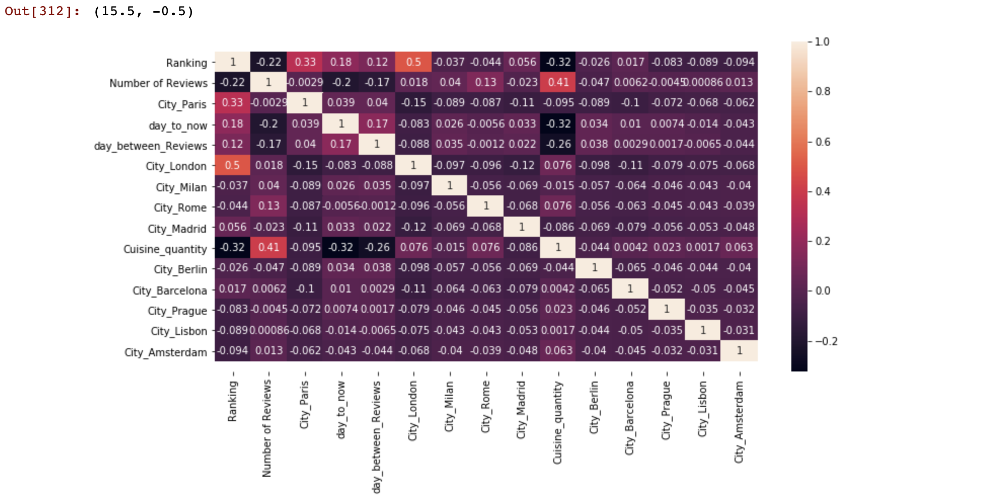

## General info
The Following notebook is an exploratory work performed by me. The code is written to predict tripadvisor restaurant Ratings based on given factors. 


## Notebooks

# The "challenge" work demonstrates ability to analyze and manipulate data, extract and create new features, and train the random trees regression model to predict the dependent variable
# The notebook 'pipelines' show my ability to create a machine learning pipeline to execute the training of a model

	
## Examples

## Skills demonstrated
* Numpy
* Pandas
* Matplotlib
* ScikitLearn
* Pipelines
* EDA
* Feature engineering

# Functions:
```
def time_to_now(row):
    if row['date_of_Review'] == []:
        return None
    return datetime.datetime.now() - pd.to_datetime(row['date_of_Review']).max()

def time_between_Reviews(row):
    if row['date_of_Review'] == []:
        return None
    return pd.to_datetime(row['date_of_Review']).max() - pd.to_datetime(row['date_of_Review']).min()
    
def dollar_to_number(x):
    if x == '$':
        return 1
    if x == '$$-$$$':
        return 2
    if x == '$$$$':
        return 3
    else:
        return 1
data['Price Range'] = data['Price Range'].apply(dollar_to_number)

```
